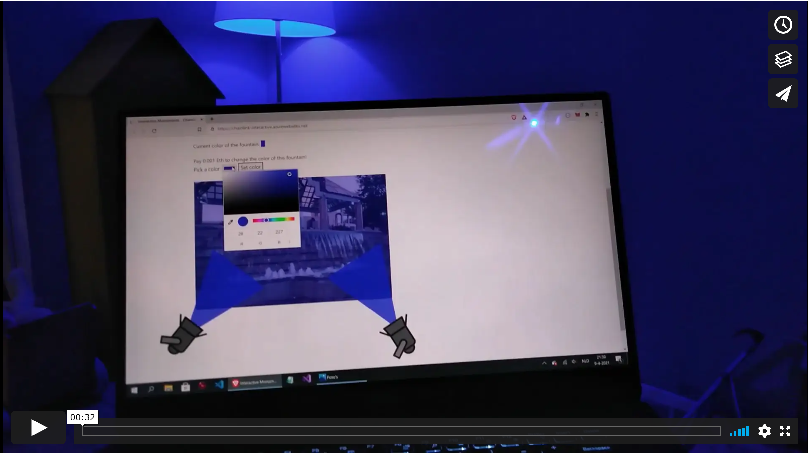
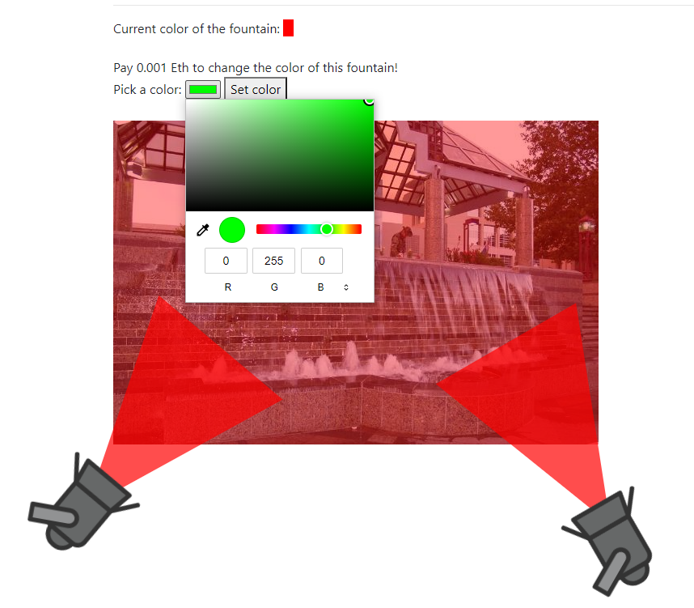
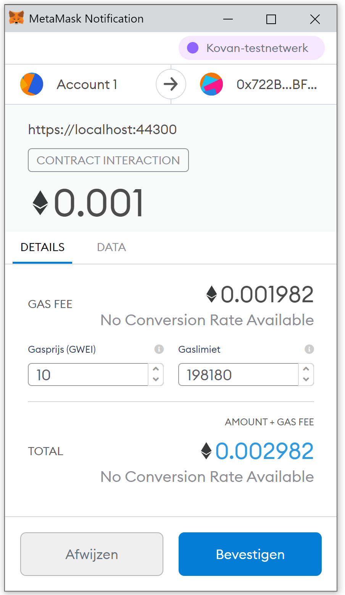
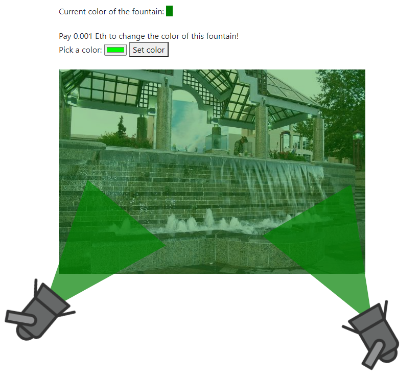

## Interactive Public Monuments
Make the city interactive and raise money for public infrastructure at the same time!

This smart contract can trigger events in the real world. For example:
- Set the color of the lights at a city fountain
- Display a text at an interactive display
- Turn on the lights of the Christmas tree
- Turn on or change the color of the lights of a city monument

Users have to pay to trigger these events. Users can send the needed funds to the smart contract. Only after the funds are received, they can trigger the interactive event.

The City is the owner of the smart contract. They can withdraw the used user funds. These funds can then be used to pay for maintenance of the monuments or other govement spending.

Live Demo: https://chainlink-interactive.azurewebsites.net

## Video Demo

## Tech Setup
- Solidity smart contract
- Chainlink to do a HTTP web request to an API
- Demo page runs on ASP.Net Core 5
- Using SignalR for realtime updates over websockets
- MetaMask and ether.js to trigger the smart contract from the browser

### Smart Contract Functions
`interactive.sol`:
- `deposit`: Deposit Ethereum to this contract
- `depositsOf(address payee)`: Check the deposited value of the given address
- `withdraw(uint amount)`: Users can withdraw unused funds and the owner can withdraw funds that have been payed
- `setColor(string color)`: Sets the color of the lights by calling a Web API using Chainlink. Depending on the configured URL, this can also trigger other real world functions.

- 
## Use the Smart Contract
- Deploy `interactive.sol` to the network:
Deployed to the Kovan test network: `0x722BcdA7BD1a0f8C1c9b7c0eefabE36c1f0fBF2a`
- As the owner, transfer `LINK` to the contract. It costs 0.1 LINK to do a web request
- (optional) As a user, pre-fund the contract with `ETH` using the `deposit` function. It costs 0.001 Eth to trigger an event
- As a user, call the `setColor` function to change the color of the monument. (optional: send at least 0.001 ETH if you have not prefunded the contract).
- As the owner, withdraw used funds from users

## Run the webserver
NOTE: When running locally, the color of the monument will not update, because the Chainlink Oracle can't connect to the API endpoint on localhost.

- Install the .Net 5 SDK https://dotnet.microsoft.com/download
- Navigate to the WebApp directory
- `dotnet restore`
- `dotnet run`
- Navigate to `https://localhost:5001`

## Screenshots
Initial State, pick a color and press `Set color`

Send the transaction using MetaMask

Result

# Chainlink Spring Hackathon 2021
This project was created for the [Chainlink Spring Hackathon 2021](https://chain.link/hackathon) ([DevPost](https://chainlink-2021.devpost.com))

Competes in the GovTech category: https://blog.chain.link/introducing-the-govtech-prize-at-the-chainlink-virtual-hackathon/

